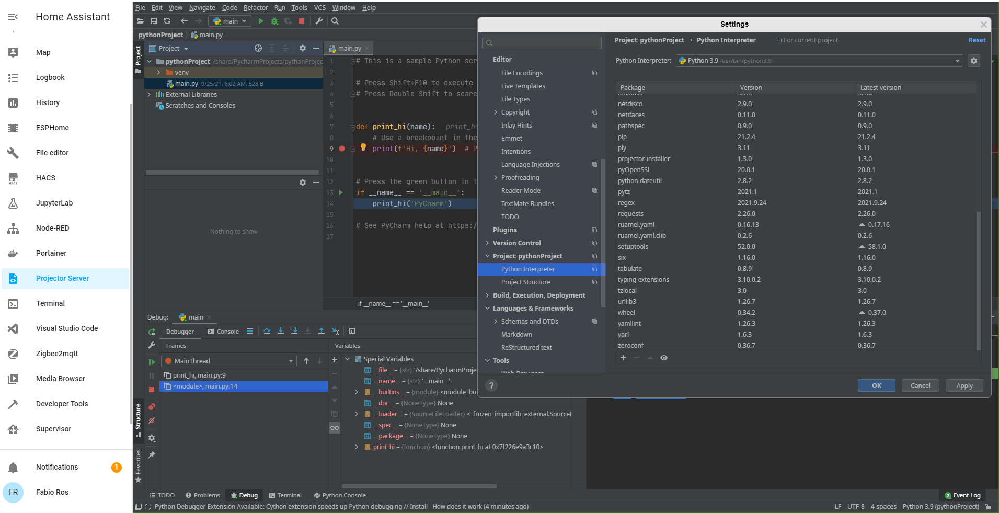

# Home Assistant Community Add-on: Projector server

[![GitHub Release][releases-shield]][releases]
[![License][license-shield]](LICENSE.md)

![Supports aarch64 Architecture][aarch64-shield]
![Supports amd64 Architecture][amd64-shield]

[![GitHub Activity][commits-shield]][commits]

JetBrains IDE's, accessible through the browser.

## About

This add-on allows JetBrains IDE's to be installed within home assistant and accessed in the UI using the browser. It is very similar to the [Visual Studio Code add-on](https://github.com/hassio-addons/addon-vscode) which was used as a starting point in the setup. The implementation uses [Projector Server](https://github.com/JetBrains/projector-server).

Using the addon configuration, a wide variety of IDE's can be installed, for example:

* IDEA Ultimate
* PyCharm
* GoLand
* WebStorm
* PhpStorm
* more [compatible IDE's](https://github.com/JetBrains/projector-installer/blob/master/projector_installer/compatible_ide.json)

__Warning:__ Both this add-on and projector are fairly new. The add-on could have issues on stability / security. Help is appreciated, use at own risk.

## Changelog & Releases

This repository keeps a change log using [GitHub's releases][releases]
functionality.

Releases are based on [Semantic Versioning][semver], and use the format
of `MAJOR.MINOR.PATCH`. In a nutshell, the version will be incremented
based on the following:

- `MAJOR`: Incompatible or major changes.
- `MINOR`: Backwards-compatible new features and enhancements.
- `PATCH`: Backwards-compatible bugfixes and package updates.

## Support

Got questions?

You have several options to get them answered:

- Find me on twitter [@fros_it](https://twitter.com/fros_it)
- [open an issue here][issue] on GitHub.

## Authors & contributors

This addon uses the [Visual Studio Code addon](https://github.com/hassio-addons/addon-vscode) as a starting point which was created by [Franck Nijhof][https://github.com/frenck].

The projector implementation is done by [Fabio Ros][https://github.com/frosit]

For a full list of all authors and contributors,
check [the contributor's page][contributors].

## License

MIT License

Copyright (c) 2019-2021 Fabio Ros

Permission is hereby granted, free of charge, to any person obtaining a copy
of this software and associated documentation files (the "Software"), to deal
in the Software without restriction, including without limitation the rights
to use, copy, modify, merge, publish, distribute, sublicense, and/or sell
copies of the Software, and to permit persons to whom the Software is
furnished to do so, subject to the following conditions:

The above copyright notice and this permission notice shall be included in all
copies or substantial portions of the Software.

THE SOFTWARE IS PROVIDED "AS IS", WITHOUT WARRANTY OF ANY KIND, EXPRESS OR
IMPLIED, INCLUDING BUT NOT LIMITED TO THE WARRANTIES OF MERCHANTABILITY,
FITNESS FOR A PARTICULAR PURPOSE AND NONINFRINGEMENT. IN NO EVENT SHALL THE
AUTHORS OR COPYRIGHT HOLDERS BE LIABLE FOR ANY CLAIM, DAMAGES OR OTHER
LIABILITY, WHETHER IN AN ACTION OF CONTRACT, TORT OR OTHERWISE, ARISING FROM,
OUT OF OR IN CONNECTION WITH THE SOFTWARE OR THE USE OR OTHER DEALINGS IN THE
SOFTWARE.

[contributors]: https://github.com/frosit/addon-projector-server/graphs/contributors
[issue]: https://github.com/frosit/addon-projector-server/issues
[releases]: https://github.com/frosit/addon-projector-server/releases
[semver]: http://semver.org/spec/v2.0.0
[ubuntu-packages]: https://packages.ubuntu.com